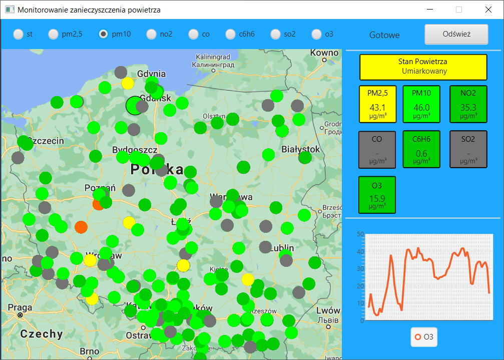

# Monitorowanie zanieczysczenia powietrza
Projekt wykonany w ramach przedmiotu *Zaawansowane Programowanie Obiektowe i Funkcyjne* w zespole Karol Degórski, Kacper Grzymkowski, Adrian Kamiński.

## API
Gałąź *master* uruchamia aplikację na danych testowych (zapisane dane z [API](https://powietrze.gios.gov.pl/pjp/content/api) w dniu 23.01.2021).

W celu sprawdzenie działania aplikacji na danych pobieranych na bieżąco należy przełączyć się na gałąź *release*.

## Screenshoty

